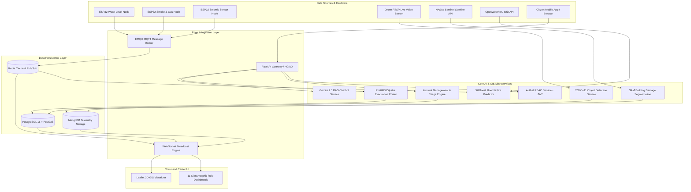
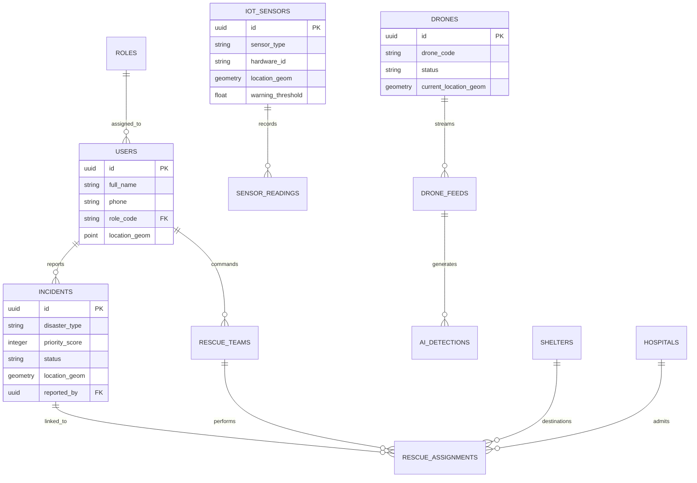

# Architecture & System Design Specification

## ResQ-AI: Disaster Response Intelligence Platform

---

## 1. High-Level UML System Architecture Diagram



---

## 2. Spatial GIS Evacuation Routing Algorithm (PostGIS)

The platform computes safe evacuation paths for rescue squads avoiding flooded, blocked, or high-risk zones using PostGIS `pgRouting` with dynamic edge weight penalty adjustments.

$$\text{Edge Weight } W_e = L_e \times \left(1 + \alpha \cdot H_e + \beta \cdot D_e\right)$$

Where:
* $L_e$ = Length of road segment in meters
* $H_e$ = Water depth / Hazard score (0.0 to 1.0)
* $D_e$ = Debris blockage flag (0 or 1)
* $\alpha, \beta$ = Penalty multiplier constants ($\alpha = 10.0, \beta = 100.0$)

---

## 3. Data Flow Diagram (DFD Level 1)

```mermaid
dfd
    process P1["1. Ingest IoT Telemetry"]
    process P2["2. Process Drone Video Feed"]
    process P3["3. Calculate Hazard Score"]
    process P4["4. Optimize Evacuation Route"]
    process P5["5. Dispatch Rescue Squad"]

    datastore DS1[("PostGIS Database")]
    datastore DS2[("Redis Stream Cache")]

    P1 -->|Sensor Readings| DS2
    P2 -->|Detected Victims| DS1
    DS2 --> P3
    P3 -->|Hazard Polygons| DS1
    DS1 --> P4
    P4 -->|Safe Path GeoJSON| P5
```

---

## 4. Entity-Relationship (ER) Diagram


